# KarmaAtma 🔮

**KarmaAtma** is a personalized astrology application built out of pure interest and curiosity in astrology.  
The idea originated when friends repeatedly asked for horoscopes — instead of replying every time, I decided to build an app so they could simply check their horoscope themselves.

The app provides personalized astrological insights, horoscopes, birth charts, daily panchang, and multimedia content through a modern and well-structured mobile experience.

---

## Features

### 1. Authentication & User Profile
Users can log in and create a personalized profile with birth details used for astrological calculations.

  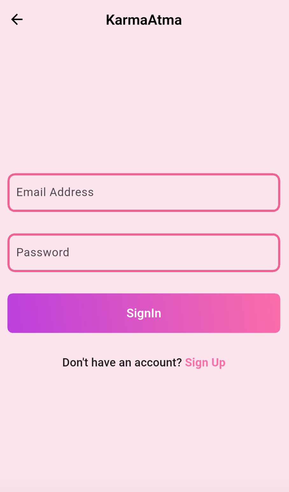
  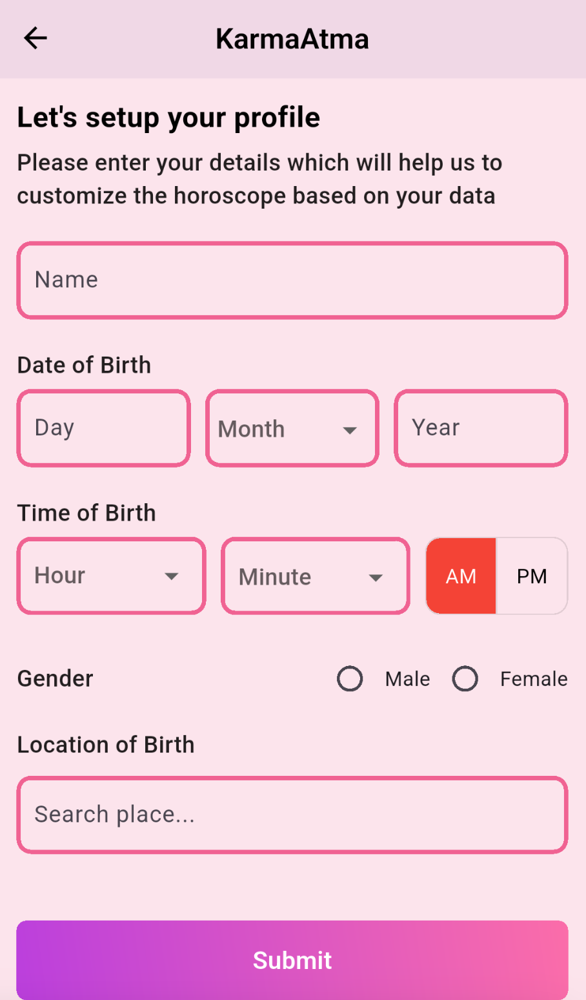

---

### 2. Home Dashboard
A visually rich home screen that acts as a central hub for astrology services and daily insights.

  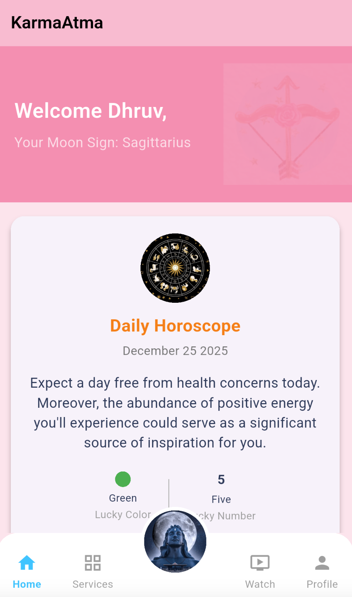
  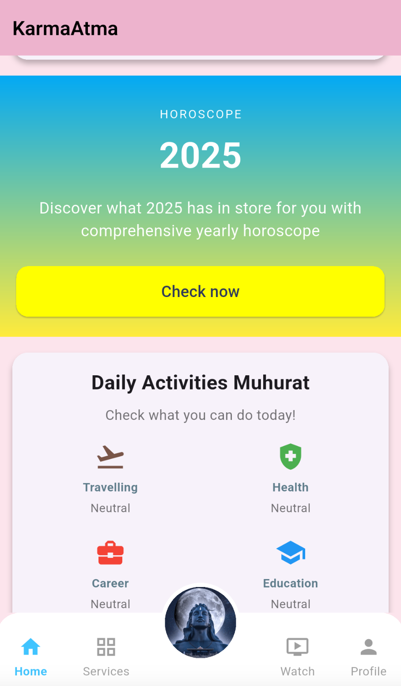
  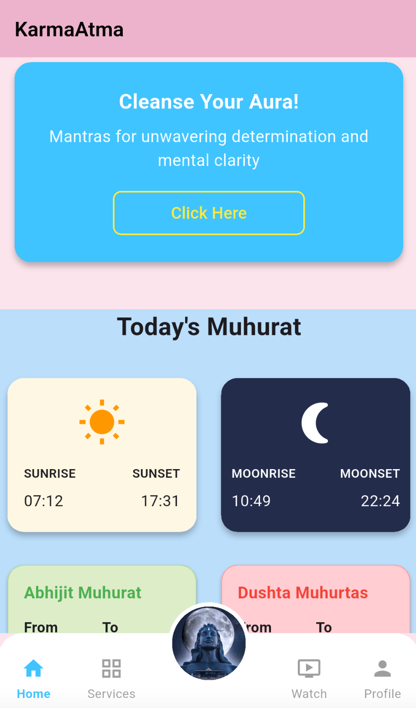

---

### 3. Personalized Horoscopes
Horoscopes are written manually (daily, weekly, monthly, yearly) for all zodiac signs based on research.

  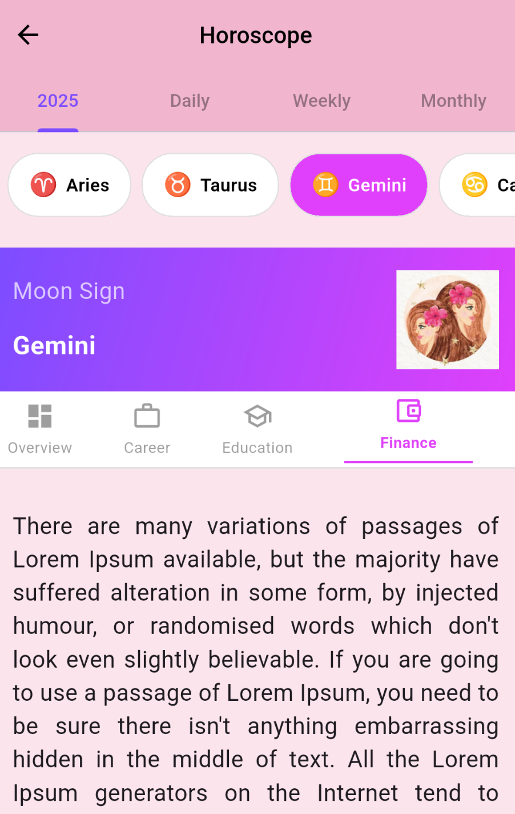
  

---

### 4. Birth Chart & House Guide
Integration with an external astrology API to generate detailed birth charts along with house-wise explanations.

  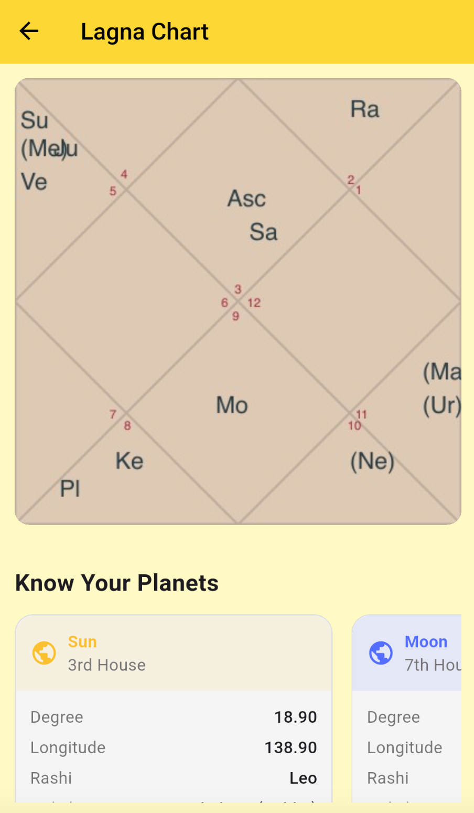
  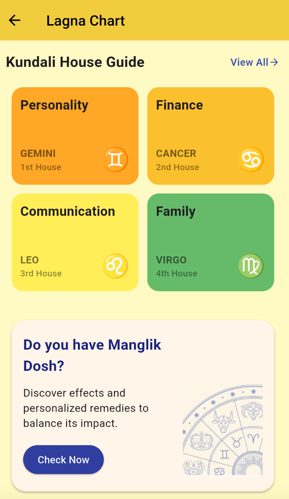

  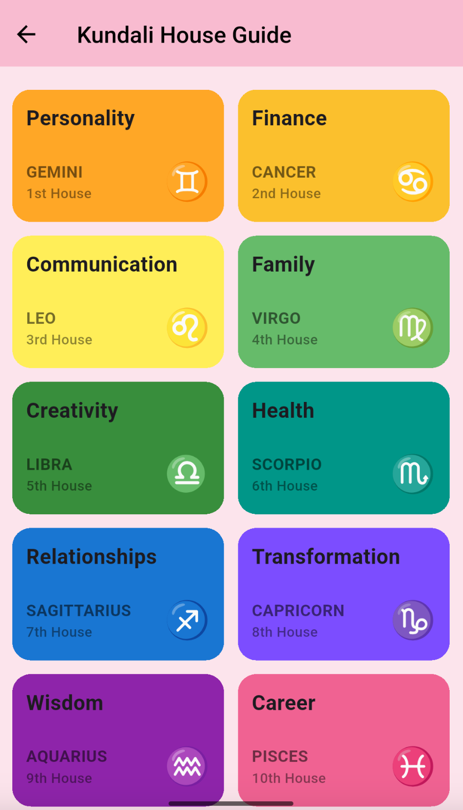
  

---

### 5. Astrology Services
Multiple astrology-related services are provided, such as daily panchang and Manglik Dosha analysis.

  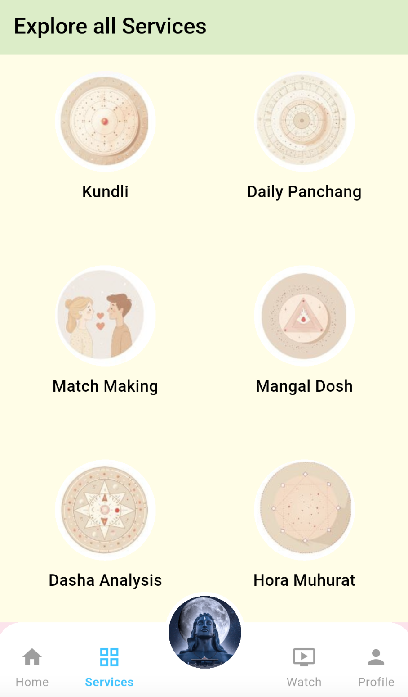

  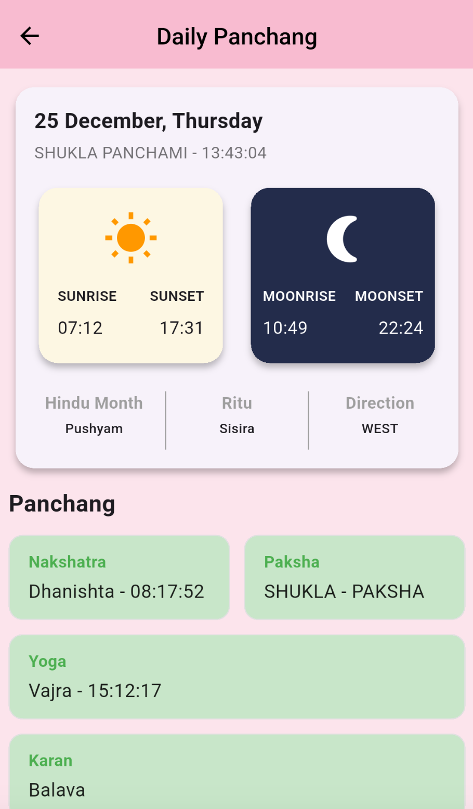
  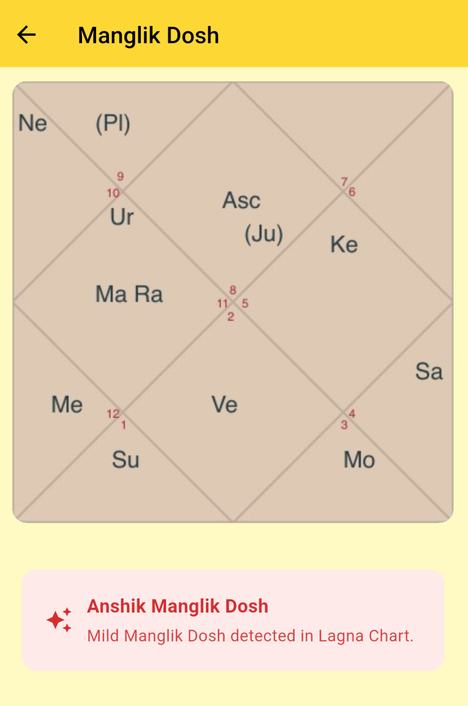
  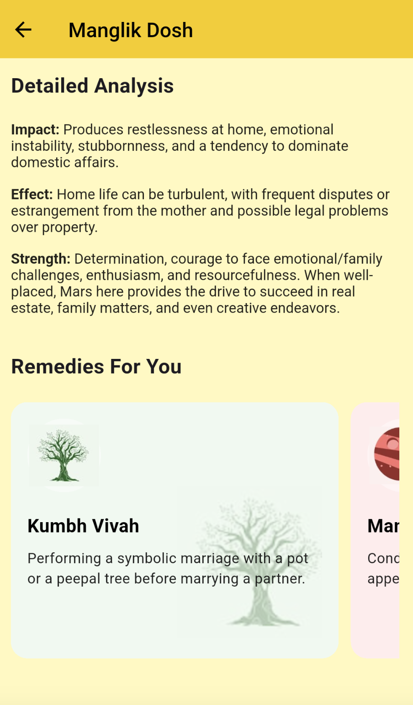

---

### 6. Daily Panchang (Auto Updated)
- Daily panchang data is cached
- Cron jobs automatically update panchang information every day
- Prevents redundant API calls and improves performance

---

### 7. External API Optimization
- Used **Bottleneck** to handle third-party API rate limits
- Ensures controlled request flow under API constraints

---

### 8. YouTube Integration
The app features a handpicked collection of YouTube videos on spirituality, mantras, meditation, and astrology, integrated seamlessly into the app experience.

  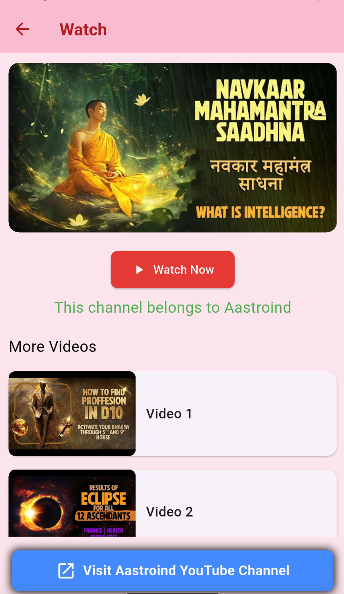

---

## Tech Stack
- **Frontend:** Flutter  
- **Backend:** Node.js, Express  
- **Database:** MongoDB
